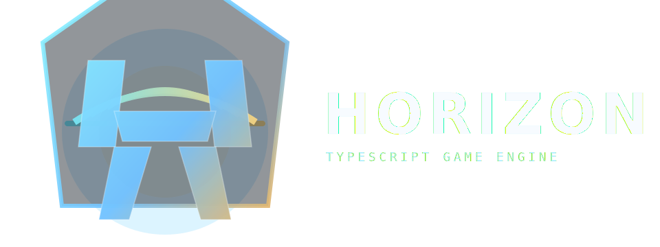

<p align="center">
  
</p>

# Horizon Engine

**A WebGPU-native, TypeScript-first open-source engine for large-scale real-time 3D worlds.**

Horizon is a data-oriented game engine built for the modern web platform. It targets WebGPU as the primary rendering backend and uses TypeScript throughout — runtime, tooling, and gameplay systems alike.

## Repository

- GitHub: `https://github.com/RobVanProd/HorizonEngine`

## Architecture

The engine is organized into isolated subsystem packages:

| Package | Description |
|---------|-------------|
| `@engine/memory` | SharedArrayBuffer pools, typed stores, binary schema utilities |
| `@engine/ecs` | Archetype-based Entity Component System with SoA storage |
| `@engine/platform` | Browser capability detection, WebGPU context, input abstraction |
| `@engine/scheduler` | Frame loop, phase-based scheduling, job dispatch |
| `@engine/profiler` | CPU timing, GPU profiling, metrics collection |
| `@engine/renderer-webgpu` | WebGPU device management, render pipelines, WGSL shaders |
| `@engine/core` | Engine bootstrap and subsystem orchestration |
| `@engine/audio` | Spatial audio system (WebAudio, 3D positional, ECS integration) |
| `@engine/assets` | Asset loading (glTF/GLB, FBX, HDR, textures) |
| `@engine/animation` | Skeletal animation, skinning, clip playback |
| `@engine/world` | Procedural world generation (terrain, splines, biomes, scatter) |
| `@engine/effects` | Particle effects (Niagara-like emitters, spline/terrain-aware) |
| `@engine/ai` | AI integration (LLM command API, ML inference, scene/world commands) |
| `@engine/devtools` | Developer tools (perf dashboard, debug draw, entity inspector) |
| `@engine/editor` | Scene editor (viewport, hierarchy, properties, assets, gizmos) |

## Prerequisites

- Node.js >= 20
- pnpm >= 9
- A browser with WebGPU support (Chrome 113+, Edge 113+, Firefox Nightly)

## Getting Started

```bash
pnpm install
pnpm check         # Type-check all packages
pnpm test          # Run tests
pnpm dev           # Start benchmark example dev server
```

## Example Apps

```bash
pnpm dev           # Benchmark scene
pnpm dev:large     # Large-scene example
pnpm dev:pbr       # PBR materials demo
pnpm dev:anim      # Animation + audio + AI demo
pnpm dev:editor    # Scene editor with procedural terrain, FBX support, and AI commands
```

The editor demo loads a boot intro video, then opens the scene editor. With the nature pack present, it now loads a lightweight demo level system and starts with `first-nature-expedition`: a seeded procedural level with a meandering trail, carved clearings, lake-style water placement, clustered vegetation, objective-gated quest beacons, a native stylized grass field with wind animation, and a small quest-driven narrative loop. The renderer can now keep HDR image-based lighting for reflections while drawing a procedural visible sky, which avoids the blurry photo-probe look in outdoor scenes. With the construction pack in `downloaded stuff/unfinished_building_high/` (subdirs with `.fbx` files), it loads procedural terrain, a road spline, and lays out assets in a grid. Without either pack, it falls back to the Fox glTF demo. Click **Play** to enter play mode and walk the level in first person. This game demo ships with the engine to showcase what can be built.

## Current Capabilities

- WebGPU renderer with PBR materials, image-based lighting, shadows, and environment maps
- ECS runtime with transform hierarchy, scheduler phases, and data-oriented component storage
- Asset pipeline for glTF/GLB, FBX, HDR environments, and textures
- Skeletal animation and skinned rendering
- Spatial audio integrated into ECS
- Procedural world generation: terrain, splines, biomes, scatter rules, seed-based reproducibility
- Particle effects with spline- and terrain-aware spawning
- AI command APIs: scene (spawn, list, inspect, setLabel), world (terrain, spline, scatter), editor (viewport, overlays), VFX, geometry stats
- In-engine devtools plus a scene editor with hierarchy, properties, assets, viewport controls, and transform gizmos
- Play mode with game demo: collect orbs, objective HUD, ships with engine

## Demo Level System

- The editor demo now resolves levels through a small level-definition contract instead of directly hardcoding one scene path.
- `first-nature-expedition` is the current procedural first level: seeded terrain, a spline-guided trail, explicit meadow clearings, a localized spring/lake water surface, and a collectible route layered on top.
- The renderer environment config now supports choosing a procedural background sky independently from the lighting probe, so HDR reflections do not force a photographic skybox.
- The renderer now includes a dedicated stylized grass material path for merged blade fields with wind animation, root-to-tip color grading, and double-sided foliage shading.
- The world runtime exposes reusable scatter exclusions (`avoidSpline`, `avoidCircles`) so levels can keep trails and landmarks readable without special-case scene code.
- The world runtime also exposes water placement controls (`waterScaleX`, `waterScaleZ`, offsets, and material overrides) so a level can ask for a pond, spring, or broad sheet instead of only a full-terrain plane.
- The gameplay layer now includes a reusable quest-chain helper for authored step progression, story text, HUD updates, and objective-gated marker visibility. The current slice uses it for camp discovery, seed recovery, shrine restoration, and overlook completion.
- The intent is to keep the demo as a proving ground for engine-facing APIs that AI tools can call and build on, not as a one-off scripted sample.

## Project Layout

```text
packages/   Engine subsystems
examples/   Runnable demos and validation apps
```

## Contributing

Contributions are welcome. See `CONTRIBUTING.md` for development workflow and expectations.

## Design Principles

1. WebGPU-first, not WebGL-first
2. Data-oriented runtime over object-heavy abstraction
3. Multithreaded by design, not as an afterthought
4. Modern lighting and visibility pipelines as core systems
5. Tooling and profiling are product features, not extras
6. Phased technical proof over feature-list theater
7. Open-source core with clear subsystem boundaries

## Development Roadmap

- **Phase 0** — Foundation and feasibility ✓
- **Phase 1** — GPU-driven rendering prototype ✓
- **Phase 2** — Runtime and simulation core ✓
- **Phase 3** — Lighting and materials ✓
- **Phase 4** — Animation and world systems ✓
- **Phase 5** — Audio, tooling, and AI integration ✓
- **Phase 6** — Scene editor and engine vertical slice ✓
- **Phase 7** — Viewport observability, gizmos, asset layout ✓
- **Phase 8** — Procedural world foundations, VFX core, lighting, geometry scalability ✓
- **Phase 9** — Play mode: first-person exploration (WASD + mouse look, pointer lock) ✓
- **Phase 10** — Game demo: collectible exploration, play HUD, ship with engine *(current)*

## Internal Design Mantra

> Do not chase engine theater. Ship proof.

## License

MIT. See `LICENSE`.
